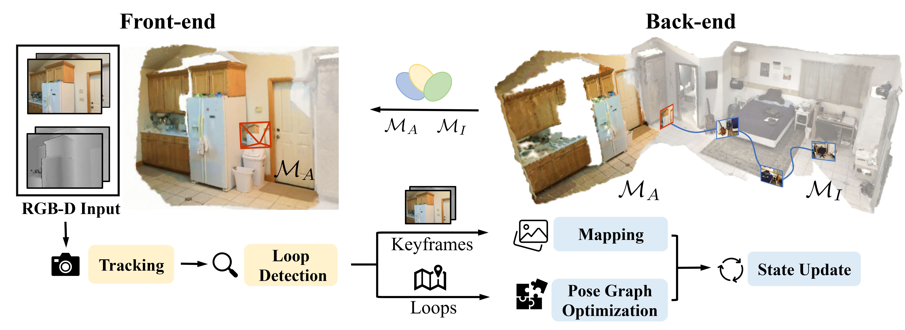

  <h1 align="center">Globally Consistent RGB-D SLAM with 2D Gaussian Splatting</h1>

  

    
    
    <a href="https://arxiv.org/abs/2506.00970">
    
  

  
  

    <a href="https://www.ipb.uni-bonn.de/people/xingguang-zhong/index.html"><strong>Xingguang Zhong</strong></a>
    ·
    <a href="https://www.ipb.uni-bonn.de/people/yue-pan/index.html"><strong>Yue Pan</strong></a>
    ·
    <a href="https://www.ipb.uni-bonn.de/people/liren-jin/index.html"><strong>Liren Jin</strong></a>
    ·
    <a href="https://www.tudelft.nl/en/staff/m.popovic/?cHash=07e8a5fb4eda6d511853b2bacaa92260"><strong>Marija Popović</strong></a>
    ·
    <a href="https://www.ipb.uni-bonn.de/people/jens-behley/"><strong>Jens Behley</strong></a>
    ·
    <a href="https://www.ipb.uni-bonn.de/people/cyrill-stachniss/"><strong>Cyrill Stachniss</strong></a>
  

  <h3 align="center">
    <a href="https://arxiv.org/abs/2506.00970">Paper</a> |
    <a href="#">Video</a>
  </h3>

  

Tracking & Mapping | Map State Update |
:-: | :-: |
<video src='https://github.com/user-attachments/assets/2ac63383-3281-4231-a10f-2fc13d8bf1de.pm4'> | <video src='https://github.com/user-attachments/assets/31784bd7-a98d-4926-a430-478a8eeb6ff1.mp4'> |

## Abstract

<strong>[Click to expand]</strong>

Recently, 3D Gaussian splatting-based RGB-D SLAM displays remarkable performance of high-fidelity 3D reconstruction. However, the lack of depth rendering consistency and efficient loop closure limits the quality of its geometric reconstructions and its ability to perform globally consistent mapping online. In this paper, we present 2DGS-SLAM, an RGB-D SLAM system using 2D Gaussian splatting as the map representation. By leveraging the depth-consistent rendering property of the 2D variant, we propose an accurate camera pose optimization method and achieve geometrically accurate 3D reconstruction. In addition, we implement efficient loop detection and camera relocalization by leveraging MASt3R, a 3D foundation model, and achieve efficient map updates by maintaining a local active map. Experiments show that our 2DGS-SLAM approach achieves superior tracking accuracy, higher surface reconstruction quality, and more consistent global map reconstruction compared to existing rendering-based SLAM methods, while maintaining high-fidelity image rendering and improved computational efficiency.

## 🚧 **under construction** 🚧

## Contact
If you have any questions, Feel free to contact:
- Xingguang Zhong {[zhong@igg.uni-bonn.de]()}
