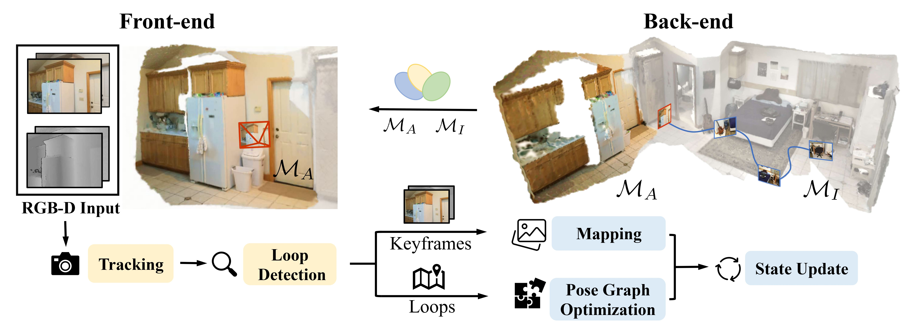

<p align="center">
  <h1 align="center">Globally Consistent RGB-D SLAM with 2D Gaussian Splatting</h1>

<p align="center">
<a href="https://github.com/PRBonn/2DGS-SLAM"></a>
<a href="https://github.com/PRBonn/2DGS-SLAM"></a>
<a href="https://www.ipb.uni-bonn.de/wp-content/papercite-data/pdf/zhong2026tro.pdf"></a>
<a href="https://github.com/PRBonn/2DGS-SLAM"></a>
</p>
  
  <p align="center">
    <a href="https://www.ipb.uni-bonn.de/people/xingguang-zhong/index.html"><strong>Xingguang Zhong</strong></a>
    &middot;
    <a href="https://www.ipb.uni-bonn.de/people/yue-pan/index.html"><strong>Yue Pan</strong></a>
    &middot;
    <a href="https://www.ipb.uni-bonn.de/people/liren-jin/index.html"><strong>Liren Jin</strong></a>
    &middot;
    <a href="https://www.tudelft.nl/en/staff/m.popovic/?cHash=07e8a5fb4eda6d511853b2bacaa92260"><strong>Marija Popovi&cacute;</strong></a>
    &middot;
    <a href="https://www.ipb.uni-bonn.de/people/jens-behley/"><strong>Jens Behley</strong></a>
    &middot;
    <a href="https://www.ipb.uni-bonn.de/people/cyrill-stachniss/"><strong>Cyrill Stachniss</strong></a>
  </p>

  <h3 align="center">
    <a href="https://www.ipb.uni-bonn.de/wp-content/papercite-data/pdf/zhong2026tro.pdf">Paper</a> |
    <a href="#">Video</a>
  </h3>
</p>

<p align="center">
  
</p>

Tracking & Mapping | Map State Update |
:-: | :-: |
<video src='https://github.com/user-attachments/assets/2ac63383-3281-4231-a10f-2fc13d8bf1de.pm4'> | <video src='https://github.com/user-attachments/assets/31784bd7-a98d-4926-a430-478a8eeb6ff1.mp4'> |


## Abstract
<details>
<summary><strong>[Click to expand]</strong></summary>
Recently, 3D Gaussian splatting-based RGB-D SLAM displays remarkable performance of high-fidelity 3D reconstruction. However, the lack of depth rendering consistency and efficient loop closure limits the quality of its geometric reconstructions and its ability to perform globally consistent mapping online. In this paper, we present 2DGS-SLAM, an RGB-D SLAM system using 2D Gaussian splatting as the map representation. By leveraging the depth-consistent rendering property of the 2D variant, we propose an accurate camera pose optimization method and achieve geometrically accurate 3D reconstruction. In addition, we implement efficient loop detection and camera relocalization by leveraging MASt3R, a 3D foundation model, and achieve efficient map updates by maintaining a local active map. Experiments show that our 2DGS-SLAM approach achieves superior tracking accuracy, higher surface reconstruction quality, and more consistent global map reconstruction compared to existing rendering-based SLAM methods, while maintaining high-fidelity image rendering and improved computational efficiency.
</details>


## Installation

### 1. Clone the repository

```bash
git clone git@github.com:PRBonn/2DGS-SLAM.git
cd 2DGS-SLAM
```

### 2. Create conda environment

```bash
conda create -n 2dgs-slam python=3.10
conda activate 2dgs-slam
```

### 3. Install PyTorch

Install PyTorch with CUDA support matching your system's CUDA version. We tested with PyTorch 2.0+ and CUDA 11.8/12.1. Check your CUDA version with `nvcc --version` or `nvidia-smi`.

```bash
# Example for CUDA 11.8
pip install torch torchvision --index-url https://download.pytorch.org/whl/cu118
# Example for CUDA 12.1
pip install torch torchvision --index-url https://download.pytorch.org/whl/cu121
```

### 4. Install dependencies

PyTorch must already be installed (step 3). The CUDA extensions compile against your environment's Torch, so `--no-build-isolation` is required:

```bash
pip install --no-build-isolation -r requirements.txt
pip install --no-build-isolation ./submodules/dust3r/asmk
```


### 5. Download MASt3R checkpoints

```bash
bash scripts/download_mast3r.sh
```


## Datasets

YAML configs live under `configs/<dataset>/` (`replica`, `scannet`, `tum`). The configs expect data under `datasets/`; adjust `dataset_path` in a scene file if you store data elsewhere. Use the download scripts below or point paths manually.

### Replica

```bash
bash scripts/download_replica.sh
```

### TUM RGB-D

```bash
bash scripts/download_tum.sh
```

### ScanNet

ScanNet requires access approval. Apply [here](http://www.scan-net.org/), then preprocess:

```bash
python scripts/scannet_preprocess.py
```

Update the `raw_folder` and `processed_folder` paths in the script before running.

### Stray Scanner (iPhone LiDAR)

[Stray Scanner](https://apps.apple.com/us/app/stray-scanner/id1557051662) is a free iOS app that records RGB-D data using the LiDAR sensor on iPhone Pro / iPad Pro devices. It captures RGB video and per-frame low-res depth maps.

**Example recording** (`4e41d0a7da`, downloaded from VSLAM-Lab's HuggingFace and unzipped under `datasets/stray_raw/`):

```bash
bash scripts/download_stray.sh
```

**Your own captures:** export your own recording (unzipped zip files) into `datasets/stray_raw/<scene_id>/`, then:

```bash
python scripts/stray_ingest.py <scene_id>
```

This preprocesses the recording for RGB-D SLAM (default 640×480) and writes `configs/stray/<scene_id>.yaml`.


## Usage

### Show help message:

```bash
python slam.py -h
```


### Running SLAM

```bash
python slam.py --config configs/replica/office0.yaml -v
```

When running on a headless server, use `-w` to launch a web-based visualizer (powered by [Spark](https://sparkjs.dev/)) instead of the GUI:

```bash
python slam.py --config configs/replica/office0.yaml -w
```

Here are some more examples on other datasets:
```bash
# TUM RGB-D
python slam.py --config configs/tum/fr3_office.yaml -w

# ScanNet
python slam.py --config configs/scannet/scene0000.yaml -w

# Stray Scanner (iPhone LiDAR)
python slam.py --config configs/stray/4e41d0a7da.yaml -w

# Replica, but only processing the first 200 frames
python slam.py --config configs/replica/office0.yaml -w --range 0 200 1
```

### Live demo with Intel RealSense

Connect an Intel RealSense D435i/D455 camera via USB-3, install `pyrealsense2`, and run:

```bash
pip install pyrealsense2
python slam.py --config configs/live/realsense.yaml
```

The GUI opens automatically. Move the camera slowly at first to let the system initialize.

### Running on all scenes without GUI

```bash
# Replica
bash scripts/run_replica.sh

# ScanNet
bash scripts/run_scannet.sh

# TUM RGB-D
bash scripts/run_tum.sh
```

### Offline Visualization

Visualize the reconstructed Gaussian map and colorized mesh:

```bash
python viser.py --ply_path <path_to_gaussians_ply> --pose_path <path_to_poses> --mesh_path <path_to_mesh_ply>
```


## Acknowledgement

This project builds upon several excellent open-source projects:
- [2D Gaussian Splatting](https://github.com/hbb1/2d-gaussian-splatting)
- [MonoGS](https://github.com/muskie82/MonoGS)
- [MASt3R](https://github.com/naver/mast3r)
- [GTSAM](https://gtsam.org/)


## Citation
If you use 2DGS-SLAM for your academic work, please cite:
```
@article{zhong2026tro,
  title   = {{Globally Consistent RGB-D SLAM with 2D Gaussian Splatting}},
  author  = {Zhong, Xingguang and Pan, Yue and Jin, Liren and Popovi{\'c}, Marija and Behley, Jens and Stachniss, Cyrill},
  journal = {IEEE Transactions on Robotics (TRO)},
  year    = {2026},
  url     = {https://arxiv.org/pdf/2506.00970.pdf}
}
```

## Contact
If you have any questions, feel free to contact:
- Xingguang Zhong {[zhong@igg.uni-bonn.de]()}
- Yue Pan {[yue.pan@igg.uni-bonn.de]()}
